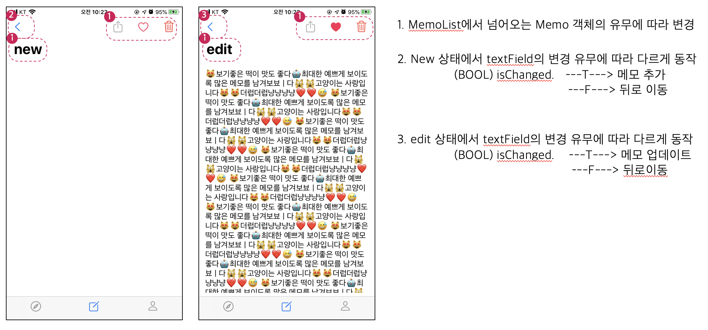

# 메모장 만들기 과제


## 1 과제 의도

- Objective-C 언어 학습
- 다양한 framework 사용
- 2월 3일 ~ 2월 6일 교육 내용 활용
  - 코코아 터치 프레임워크 이해
  - UIKit 및 tableViewController, NavigationController
  - 스토리보드 사용
  - 애플 인증서, 프로비저닝

---


## 2 기술 스펙


| 기능   | 세부내용                                                     | 예정 | 일정        |
| ------ | ------------------------------------------------------------ | ---- | ----------- |
| 로그인 | AuthenticationServices framework - Sign In with Apple 기능을 이용한 로그인 | 2    | 20일 ~ 21일 |
|        | keychain을 통해 로그인 유지                                  | 1    | 25일        |
|        | 로그아웃                                                     | 1    | 25일        |
| 메모   | UITableViewController를 활용한 메모 리스트 구현              | 1    | 10일 ~ 11일 |
|        | Swipe 액션 추가 - notification / 삭제기능                    | 2    | 17일 ~ 18일 |
|        | CoreData                                                     | 5    | 12일 ~ 16일 |
|        | Lottie 오픈소스 활용 / cocoapod활용 의존성 관리              | 1    | 24일        |
|        | Favorite 버튼                                                | 1    | 22일        |
| 프로필 | ImagePickerController를 사용하여 프로필 사진등록             | 1    | 23일        |

기간 : 2월 10일 ~ 2월 25일

---


## 3 개발 스펙

- iOS 13
  - Sign In With Apple 기능 사용
- Xcode 11
- Objective - c

---


##  4 세부사항

### 4.1 Sign In With Apple 로그인 / 로그아웃

- Sign In 성공시 keychain에 user_id 저장

- 로그아웃 시 keychain에 user_id 삭제

- 첫화면 시작시 keychain 확인하여 있으면 TabBarController로 이동

  


### 4.2 UserNotification

- permission의 위치
  - 앱에서 해당 기능을 처음 사용할 때 알림
  - 어떤 동작때 해당 기능이 사용되는지 알려주기 위해 적절한 곳에 위치
  
  
  
  - 처음에는 앱 실행시 퍼미션을 요청했지만 가이드에 맞춰 swipe 동작 이후에 퍼미션
  
- Foreground 상황에서 LocalNotification

  - `UNuserNotificationCenterDelegate` 를 구현하여 foreground 상태에서도 noti를 받을 수 있도록 처리

    

    


### 4.3 Lottie 오픈 소스 및 Cocoa pod

- airbnb 에서 제공하는 애니메이션 오픈소스 `Lottie`
  
  - https://github.com/airbnb/lottie-android
  
- Cocoa Pod을 활용하여 의존성 관리

  - Podfile 파일에 `pod lotties-ios`
  - `pod install`
  - 현재 3.x 버전은 swift로 모두 변경된 상태, 때문에 objective-c를 지원하는 2.x 파일을 다운 받아야 함.

  

  - 위와 같이 podlist를 작성해 주어 objective-c에서 활용할 수 있도록 수정


- 사용방법

  ```objective-c
  LOTAnimationView *animation = [[LOTAnimationView alloc] initWithContentsOfURL:[NSURL URLWithString:URL]];
  [self.view addSubview:animation];
  [animation playWithCompletion:^(BOOL animationFinished) {
    // Do Something
  }];
  ```


- 적용

  


### 4.4 새 메모 화면과 수정화면

- 새 메모 화면과 수정화면을 각각의 View를 만들어서 적용


- 비슷한 화면이라 한화면으로 만들 수 있을 것 (apple memo앱)

  

- barButtonItem들이 새 메모 화면과 수정 화면에서 다르게 동작 해야함
  - 메모 변수의 nil 여부에 따라 새 메모와 수정 화면을 파악
    - 액션 버튼과 좋아요 버튼의 경우 위의 경우에 따라 다르게 처리

- 버튼 이벤트마다 해당 코드를 재 작성해야하기 때문에 `(BOOL)isNewMemo`, `(BOOL)isChanged` 메소드로 정의

- CoreData의 경우 DataManager.h 파일을 Singleton 패턴으로 적용


### 4.5 키보드 상태 변경 / Observer 패턴

- 메모 작성 페이지에서 TextField를 선택시 키보드가 올라옴
- 메모의 길이가 길 경우 키보드가 메모를 가릴수 있기 때문에 TextField의 사이즈를 조정해 주어야 함
- NSNotificationCenter addObserverForName: object: queue: usingBlock: 메소드를 이용해서 키보드 상태를 옵저빙함
- usingBlock에 변경된 키보드 높이만큼 textField와 verticalScroll의 높이를 변경
- ControllerView 객체 제거 시 observer를 remove함


### 4.6 프로필 사진저장

- UIImagePickerController를 사용하여 포토 라이브러리에서 사진을 가져옴
- UIImagePickerControllerDelegate를 구현하 imageView에 저장해주고, 파일 형태로 디렉토리에 저장
- 파일이름을 KeyChain에 저장된 user_id를 사용하여 저장
- Profile ViewController가 실행될때 user_id에 해당하는 파일을 load


---


